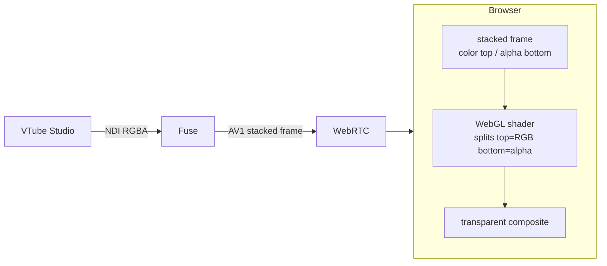

#  fuse

streams vtube studio to any web page over webrtc w/ full transparency. uses NDI, AV1 encoding, and a WebGL shader to composite the alpha channel on the client.

## how it works / flow

## requirements

- NDI Runtime (`winget install NDI.NDIRuntime`)
- FFmpeg (`winget install Gyan.FFmpeg`)
- Ideally, an Intel GPU for AV1 encoding. There is no implementation for any other GPU, but it will fallback to software encoding if needed.
- VTube Studio with NDI & NDI V5 enabled.

## quick start

- run `task` (requires https://taskfile.dev) or download from releases
- open `fuse.exe`
- go to system tray, right click and select an NDI source
- open `http://localhost:9090` in your browser or implement into your own app
- example implementation in example/ in Svelte.

## config

| variable | default | what it does |
|---|---|---|
| `FUSE_PORT` | `9090` | http port for signaling + static files |
| `FUSE_FPS` | `30` | target framerate |
| `FUSE_BITRATE` | `8M` | av1 encoding bitrate |
| `FFMPEG_PATH` | *(auto-detect)* | path to ffmpeg binary |

resolution gets detected automatically from the ndi source.

## troubleshooting

- **no connection** -- make sure fuse is running, check `fuse.log` for the http server line. make sure port 9090 isn't firewalled
- **no video** -- select an ndi source from the system tray. check `fuse.log` for `pipeline started`
- **no transparency** -- your browser needs webgl2. make sure the canvas has `background: transparent`
- **high latency** -- try lowering `FUSE_BITRATE` (e.g. `4M`). hw encoder (`av1_qsv`) is way faster than software (`libsvtav1`)
- **black/corrupt video** -- prob a resolution mismatch. check `fuse.log` for "resolution changed"
